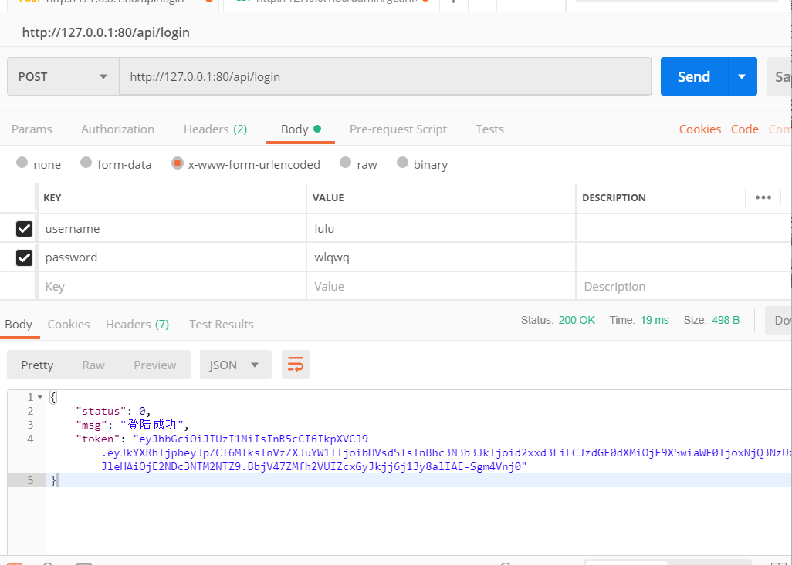
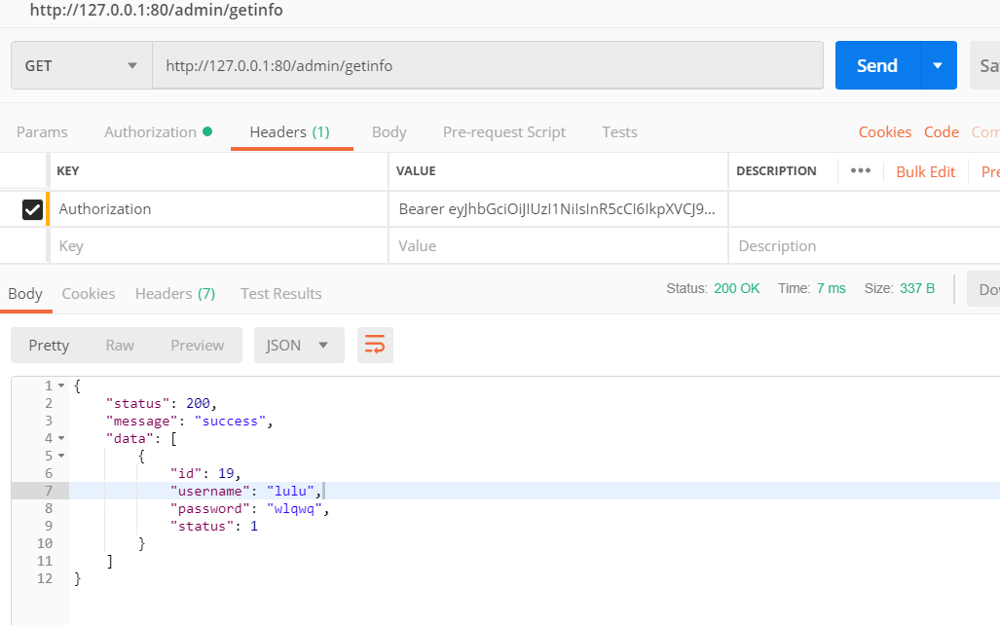

## Node.js学习记录

Node.js是一个基于Chrome V8引擎的JavaScript 运行环境

浏览器是JS的前端运行环境，而Node.js是JS的后端运行环境

Node.js中无法调用DOM和BOM等浏览器内置API

### fs模块

fs模块是Node.js提供的用来操作文件的模块，他提供了一些列的方法和属性，例如：

- fs.readFile()方法，用来读取指定文件中的内容
- fs.writeFile()方法，用来向指定文件中写入内容

只需要用如下方法导入就可以使用fs模块

```js
const fs = require('fs')
```

#### **fs.readFile()**方法

可以读取指定文件中的内容，格式如下

```js
fs.readFile(path[, options], callback)
```

参数一：必选参数，表示文件路径

参数二：可选参数，表示以什么编码格式来读取文件

参数三：文件读取完成后的回调函数

**实例：**

```js
//导入fs模块
const fs = require('fs');
fs.readFile('./1.txt','utf8',function(err,dataStr){
	console.log(err);
	console.log(dataStr);
})
```

参数一：读取文件的存放路径
参数二：读取文件时候采用的编码格式，默认是`utf8`
参数三：回调函数，拿到读取失败和成功的结果 `err`、`dataStr`

读取成功的话，err值为null,读取失败的话，err的值为一个错误对象，dataStr为undefined,所以**可以通过判断err对象是否为null来知晓文件读取的结果**

所以可以改进成如下：

```js
const fs = require('fs');
fs.readFile('./12.txt','utf8',function(err,dataStr){
	if(err){
		console.log('失败了，'+err.message)
		return;
	}else{
		console.log('文件读取内容是：'+ dataStr);
	}
})
//当读取不存在的文件时，输出 `失败了，ENOENT: no such file or directory, open 'D:\web前端\nodejs\12.txt`
//当读取文件存在时，输出 `文件读取内容是：第一次测试哦`
```

#### fs.writeFile()

可以向指定文件写入内容，语法格式如下：

```js
fs.writeFile(file,data[, options], callback)
```

- 参数一：必选参数，表示文件路径

- 参数二：必选参数，表示要写入的内容
- 参数三：可选参数，表示以什么格式写入，默认为`utf8`
- 参数四：必选参数，写入成功的回调函数

```js
const fs = require('fs')

fs.writeFile('./1.txt','我是KuKi!!','utf8',function(err){
	console.log(err)
})
//写入成功，err为null
//写入失败，err的值为一个错误对象
```

**稍加改进：**

```js
const fs = require('fs')

fs.writeFile('./2.txt','我是KuKi!!','utf8',function(err){
	if(err){
		console.log('文件写入失败'+ err.message);
		return;
	}else{
		console.log('写入成功')
	}
})
```

**练习：考试成绩整理**

**步骤：**

- 导入fs模块
- 读取成绩文件
- 判断是否读取成功
- 处理数据
- 处理后重新写入新文件中

```js
const fs = require('fs');
let url = './grade.txt'
let url2 = './grade_new.txt'
fs.readFile(url,'utf8',function(err,data){
	if(err){
		console.log('读取失败'+err.message);
	}else{
		let arr = data.split(' ');
        //将字符串通过空格分割成数组
		let arrnew = [];
		arr.forEach(item=>{
			arrnew.push(item.replace('=',':'));
		})
		const result = arrnew.join('\r\n');
        //将数组转换成用\r\n相连接的字符串
		console.log(result);
		fs.writeFile(url2,result,'utf8',function(err){
			if(err){
				console.log('写入失败'+err.message);
			}else{
				console.log('写入成功')
			}
		})
	}
})
```

##### **关于路径问题**

由于fs模块操作文件时，用相对路径可能会出现路径动态拼接错误的问题，代码执行时，会以执行node命令时所处的目录，动态拼接被操作文件的完整路径，就可能会导致路径错误。所以就需要绝对路径，防止动态拼接的问题，但是直接写绝对路径维护性过差，这时候就需要用到`__dirname`

`__dirname`表示当前的文件所处目录

经过修改，变成如下：

```js
const fs = require('fs');
let url = __dirname + '/grade.txt'
let url2 =  __dirname + '/grade_new.txt'
fs.readFile(url,'utf8',function(err,data){
	if(err){
		console.log('读取失败'+err.message);
	}else{
		let arr = data.split(' ');
		let arrnew = [];
		arr.forEach(item=>{
			arrnew.push(item.replace('=',':'));
		})
		const result = arrnew.join('\r\n');
		console.log(result);
		fs.writeFile(url2,result,'utf8',function(err){
			if(err){
				console.log('写入失败'+err.message);
			}else{
				console.log('写入成功')
			}
		})
	}
})
```

此时就可以不用担心文件路径拼接出错，自由读取存取文件啦

### path路径模块

path模块是Node.js官方提供的用来处理路径的模块。

例如：

- `path.join()`方法，用来将多个路径片段拼接成一个完整的路径字符串。之前拼接用的是`+`，但是不太正规，可以用join拼接

- `path.basename()`方法，用来从路径字符串中，将文件名解析出来

如果要使用path模块，需要先导入

```js
const path = require('path')
```

#### path.join()

使用此方法，可以把多个路径片段拼接成完整的路径字符串

```js
path.join([...paths])
```

- ...paths<string> 路径片段序列
- 返回值<string>

例如：

```js
const pathStr = path.join('a','/b/c','../','./d','e')
console.log(pathStr) //输出 \a\b\d\e

const pathStr2 = path.join(__dirname,'./1.txt')
```

#### path.basename()

使用path.basename()方法可以获取路径中的最后一部分，经常通过这个方法获取路径中的文件名，格式如下：

```js
path.basename(path[, ext])
```

```js
const fpath = '/a/v/c/index.html'
var fullName = path.basename(fpath)
console.log(fullName) // index.html
var nameWithoutExt = path.basename(fpath,'.html')
console.log(nameWithoutExt)
```

#### path.extname()

使用此方法可以获取路径中扩展名部分

```js
path.extname(path)
```

path <string> 必选参数，表示路径的字符串

返回:<string> 拓展名部分

```js
const path = 'a/b/c/index.html'
const fext = path.extname(path)
console.log(fext) // 输出 .html
```

**练习：实现拆分html文件**

目的：将素材目录下的index.html页面，拆分成三个文件，分别是：index.css,index.js,index.html。并将拆分出来的三个文件，存放到clock目录中。

**步骤：**

- 创建正则表达式用来匹配<script><style>标签
- 使用fs模块，去读需要被处理的HTML文件
- 自定义resolveCSS方法，来写入index.css样式文件
- 自定义resolveJS方法，来写入index.js 脚本文件
- 自定义resolveHTML方法，来写入index,html文件

**实现：**

```js
const fs = require('fs');
const path = require('path');
//定义正则
const regStyle = /<style>[\s\S]*<\/style>/;
const regScript = /<script>[\s\S]*<\/script>/;
fs.readFile(path.join(__dirname,'./index.html'),'utf8',(err,data)=>{
	if(err){
		console.log('读取失败'+err.message);
		return;
	}
	let url = path.join(__dirname,'./dist');
	 if(!fs.existsSync(url)){
		fs.mkdirSync(url);
	}
	resolveCSS(data);
	resolveJS(data);
	resolveHTML(data);
})

var resolveCSS = function(data){
	let css = regStyle.exec(data);
	const newCSS = css[0].replace('<style>','').replace('</style>','');
	fs.writeFile(path.join(__dirname,'./dist/index.css'),newCSS,err=>{
		if(err){
			console.log('写入CSS错误',+err.message);
			return;
		}
		console.log('写入CSS样式成功');
	})
}

var resolveJS = function(data){
	let js = regScript.exec(data);
	const newJS = js[0].replace('<script>','').replace('</script>','');
	fs.writeFile(path.join(__dirname,'./dist/index.js'),newJS,err=>{
		if(err){
			console.log('写入JS错误',+err.message);
			return;
		}
		console.log('写入JS样式成功');
	})
}

var resolveHTML = function(data){
	let css = regStyle.exec(data);
	let js = regScript.exec(data);
	const newHTML = data.replace(js,'<script src="./index.js"></script>').replace(css,'<link rel="stylesheet" type="text/css"  href="./index.css">');
	fs.writeFile(path.join(__dirname,'./dist/index.html'),newHTML,err=>{
		if(err){
			console.log('写入HTML错误',+err.message);
			return;
		}
		console.log('写入HTML成功')
	})
}

```

(等以后有时间用promise.all实现一次orz)

### http模块

http模块是Node.js官方提供的，用来创建web服务器的模块，通过http模块提供的http.createServer()方法，就能方便的把一台普通的电脑，变成一台web服务器，从而对外提供web资源服务

导入：

```js
const http = require('http')
```

#### IP地址

ip地址就是互联网上每台计算机的唯一地址，具有唯一性，只有知道对方ip地址的前提下，才能与对应的电脑置渐进行数据通信。

创建最基本的web服务器：

步骤：

- 导入http模块
- 创建web服务器实例
- 为服务器实例绑定request事件，监听客户端的请求
- 启动服务器

```js
const http = require('http')

const server = http.createServer()

server.on('request',function(req,res){
	const url = req.url;
	const method = req.method;
	const str = `你请求的url地址是${url},请求的方法是${method}`
	//调用res.setHeader()方法，设置Content-Type 响应头，从而解决中文乱码问题
	res.setHeader('Content-Type','text/html; charset=utf-8')
	//调用res.end()方法，向客户端响应一些内容
	res.end(str);
})

server.listen(80,function(){
	console.log('server running at http://127.0.0.1')
})
```

根据不同url显示不同页面内容

```js
const server = http.createServer()

server.on('request',function(req,res){
	const url = req.url;
	const method = req.method;
	let content = '404 not found'
	if(url === '/' || url === '/index.html'){
		content = '<h1>首页</h1>'
	}else if(url ==='/about'){
		content = '<h1>关于</h1>'
	}
	//调用res.setHeader()方法，设置Content-Type 响应头，从而解决中文乱码问题
	res.setHeader('Content-Type','text/html; charset=utf-8')
	//调用res.end()方法，向客户端响应一些内容
	res.end(content);
})

server.listen(80,function(){
	console.log('server running at http://127.0.0.1')
})
```


**练习：实现clock时钟的web服务器**

实现步骤：

- 导入需要的模块
- 创建基本的web服务器
- 将资源的请求url地址映射为文件的存放路径
- 读取文件内容并响应给客户端
- 优化资源的请求路径

```js
const http = require('http')
const fs = require('fs')
const path = require('path')

const server = http.createServer()

server.on('request',function(req,res){
	const url = req.url;
	const fpath = path.join(__dirname,url);
	fs.readFile(fpath,'utf8',(err,data)=>{
		if(err) return res.end('request error')
		res.end(data)
	})
})

server.listen(80,function(){
	console.log('server running at http://127.0.0.1')
})
```

### 模块化

编程领域中的模块化，就是遵守固定的规则，把一个大文件拆分成独立并相互依赖的多个小模块。

模块拆分的好处：

- 提高了代码的复用性
- 提高了代码的可维护性
- 可以实现按需加载
- 防止全局污染

Node.js中的模块化

Node.js中根据模块来源的不同，将模块分成了三大类：

- 内置模块（Node.js官方提供的，例如fs，path，http等）
- 自定义模块（自己写的js文件）
- 第三方模块（第三方开发出来的，使用前需要下载）

**加载模块**

require()方法加载其他模块时，会执行其它模块的代码

**暴露模块**

module.exports

### npm包

定义格式化时间的方法

```js
function dateformat(data){
	const dt = new Date(data);
	
	const y = dt.getFullYear();
	const m = padZero(dt.getMonth())+1;
	const d = padZero(dt.getDate());
	
	
	const hh = padZero(dt.getHours());
	const mm = padZero(dt.getMinutes());
	const ss = padZero(dt.getSeconds());
	
	return `${y}-${m}-${d} ${hh}:${mm}:${ss}`
}

function padZero(n){
	n > 9 ? n : '0'+n
}

module.exports = {
	dateformat
}
```

```js
const time = require('./timeformat.js')

const dt = new Date()
console.log(dt)
let newdate = time.dateformat(dt)
console.log(newdate)
```

格式化时间的高级做法：

直接npm下载安装格式化时间的包，require导入然后进行格式化

## Express

什么是Express？

Express的作用和Nodejs内置的http模块类似，是专门用来创建Web服务器的

Express是基于http内置模块封装出来的，能提高开发效率

Express可以做web网站服务器和API接口的服务器

```js
const express = require('express');
//创建web服务器
const app = express();
//启动web服务器监听80端口
app.listen(80,()=>{
	console.log('express server running at http://127.0.0.1')
})
```

### 监听GET请求

通过app.get()监听get请求

```js
app.get('url',function(req,res){//函数})
```

req:请求对象（包含了请求相关属性与方法）

res:响应对象（包含了响应相关的属性与方法）

### 监听POST请求

通过app.post()方法，可以监听 客户端的POST请求

```js
app.post('url',funciton(req,res){//函数})
```

req:请求对象（包含了请求相关属性与方法）

res:响应对象（包含了响应相关的属性与方法）

**把内容响应给客户端**

通过res.send()方法，可以把处理好的内容发送给客户端

```js
app.get('/user',(req,res)=>{
	res.send({name:'zs',age:20,sex:'男'})
})
app.post('/user',(req,res)=>{
	res.send('请求成功')
})
```

```js
const express = require('express');

const app = express();

app.listen(80,function(){
	console.log('runnig')
})

app.get('/user',(req,res)=>{
	res.send({name:'wanglu',age:21,sex:'女'});
})
app.post('/user',(req,res)=>{
	res.send('success');
})
```

通过postman测试，数据反馈成功

**获取URL中携带的查询参数**

通过req.query对象，可以访问到客户端通过查询字符串的形式，发送到服务器的参数

```js
app.get('/',(req,res)=>{
	console.log(req.query)
	res.send(req.query)
})
```

**获取URL中的动态参数**

通过req.params对象，可以访问到URL中，通过`:`匹配到的动态参数

```js
//:id是一个动态的参数
app.get('/user/:id',(req,res)=>{
	res.send(req.params)
})
```

存在跨越问题就加一条`res.setHeader('Access-Control-Allow-Origin', '*');`

**托管静态资源**

**express.static()**

express提供了一个非常好用的函数，叫做express.static()，通过它，我们可以非常方便地创建一个静态资源服务器，例如，通过如下就可以将public目录下的图片，css文件，js文件对外开放访问了

```js
app.use(express.static('public'))
```

例如：`http://localhost:80/css/style.css`

**注意：**Express在指定的静态目录中查找文件，并对外提供资源的访问路径，因此，存放静态文件的目录名不会出现在URL中

**挂在路径资源**

```js
app.use('files',express.static('public'))
```

变成了：`http://localhost:80/files/css/style.css`

### nodemon

nodemon可以监听你的代码变化，当代码变化时帮你自动重启服务器，不用手动重启。

使用：`nodemon xxx.js`

### 路由

什么是路由？

广义上来讲，路由就是映射关系。

在Express中，路由指的是客户端的请求与服务器处理函数之间的映射关系

Express中的路由分三部分组成，分别是请求的类型，请求的URL地址，处理函数，格式如下

```js
app.method(path,handler)
```

每当一个请求到达服务器之后，需要先经过路由的匹配，只有匹配成功之后，才会调用对应的处理函数

在匹配时，会按照路由的顺序进行匹配，如果请求类型和请求的URL同时匹配成功，则Express会将这次请求，转交给对应的function函数进行处理

```js
app.get('/user',(req,res)=>{
	res.send(req.params)
})
```

如上就算挂载路由（挂载到app上）

为了方便对路由进行模块化的管理，Express不建议将路由直接挂载到app上，而是推荐将路由抽离为单独的模块

- 调用express.Router()函数创建路由对象

- 由路由对象上挂在具体的路由

- 使用module.exports向外共享路由对象

- 使用app.use()函数注册路由模块

```js
//路由模块
const express = require('express');
//创建路由对象
const router = express.Router();
//挂载具体的理由
router.get('/user',(req,res)=>{
	res.send('get user');
})
router.post('user/post',(req,res)=>{
	res.send('post user');
})
//向外导出路由对象
module.exports = router
```

```js
const express = require('express');
const app = express()

const router = require('./router.js');
app.use(router)
app.listen(80,()=>{
    console.log('running');
})
```

**注：**app.use()函数的作用，就是来注册全局中间件

**为路由模块添加前缀**

在导入路由模块时，加入前缀

```js
app.user('/api',router)
```

在访问router里的模块，都会有api这个前缀，和静态资源统一挂载前缀方法是一样的

### 中间件

什么是中间件，指的是业务处理过程中的中间处理环节，上一级的输出作为下一级的输入

**调用流程**

当一个请求到达Express的服务器之后，可以连续调用多个中间件，从而对这次请求进行预处理，本质上就是一个function处理函数

**next函数的作用**

next函数是实现多个中间件连续调用的关键，它表示把流转关系转交给下一个中间件或路由

#### **定义中间件函数**

```js
//常量mw所指向的就是一个中间件函数
const mw = function(req,res,next){
	console.log('这是一个中间件函数');
    //在当前中间件的业务处理完毕后，必须调用next()函数
    //表示把流转关系转交给下一个中间件或者路由
	next();
}
```

**全局生效的中间件**

客户端发起的任何请求，到达服务器之后，都会触发的中间件，叫做全局生效的中间件

通过调用app.use()即可定义一个全局生效的中间件

```js
const mw = function(req,res,next){
	console.log('这是一个中间件函数');
	next();
}

app.use(mw)
```

本质类似于拦截器，如果不next就不会往下运行

多个中间件之间，共享同一份req和res，基于这样的特性，我们可以在上游的中间件中，统一为req或res对象添加自定义的属性或方法，供下游的中间件或路由进行使用

**局部生效的中间件**

不适用app.use()定义的中间件，叫做局部生效的中间件，如下

```js
const mw1 = function(req,res,next){
	console.log('中间件函数')
	next();
}
//mw1这个中间件旨在当前路由中生效，这种用法属于是局部生效的中间件
app.get('/',mw1,function(req,res){
	res.send('home')
})
//mw1这个中间件不会影响下面这个路由
app.get('/user',function(req,res){
	res.send('user')
})
```

**注意**：中间件要写在匹配的路由的前面，因为服务器是从上往下匹配的，如果先匹配到了路由，就会直接响应了而不是往下匹配中间件了

**中间件的注意事项：**

- 一定要在路由之前注册中间件
- 客户端发送过来的请求，可以连续调用多个中间件进行处理
- 执行完中间件的业务代码之后，不要忘记调用next()函数
- 为了防止代码逻辑混乱，调用next()函数后，不要再写额外的代码
- 连续调用多个中间件时，多个中间件之间，共享req和res对象

**应用级别的中间件**

以上直接绑定到app实例上的，都是应用级别中间件

**路由级别中间件**

绑定到router实力上的，时路由级别中间件

```js
const app = express();
const router = express.Router();

router.use(function(req,res,next){
	console.log('Time',Date.now())
    next()
})
app.use('/',router)
```

**错误级别的中间件**

错误级别中间件的作用：专门用来捕获整个项目中发生的异常错误，从而防止项目异常崩溃的问题。格式：错误级别中间件的function处理函数中，必须有四个形参

```js
app.get('/',function(req,res){
	throw new Error('服务器内部发生了错误');
	res.send('home')
})
app.use(function(err,req,res,next){
	console.log('发生了错误'+err.message)
	res.send('Error!'+err.message)
})
```

**注意**：错误级别的中间件，必须注册在所有路由之后

**内置中间件**

- express.static：托管静态资源如HTML,CSS,图片等
- express.json：通过它可以解析JSON格式的请求体数据

- express.urlencoded:解析URL-encoded格式的请求体数据

用法是

```js
app.use(express.json())
app.use(express.urlencoded({extended:false}))
```

**示例**：

```js
const express = require('express')
const app = express()

//通过exoress.json()来解析表单中JSON格式的数据
app.use(express.json())
app.use(express.urlencoded({entended:false}))

app.post('/user',(req,res)=>{
	console.log(req.body)
	//在服务器可以用req.body这个属性，来接受客户端发送过来的请求体数据
	//默认情况下，如果不配置解析表单数据的中间件，req.body默认等于undefined
	//json数据是用postman在body里的x-www-form-urlencoded发送的模拟数据
	res.send('ok')
})

app.post('/book',(req,res)=>{
	//json数据是用postman在body里的row选择json格式发送的模拟数据
	console.log(req.body)
	res.send('ok')
})

app.listen(80,()=>{
	console.log('running')
})

```

**第三方的中间件**

非Express官方内置的，是由第三方开发出来的中间件。例如之前的版本经常使用body-parser这个第三方中间件来解析请求体数据

#### **自定义中间件**

需求描述和实现步骤：

手动模拟一个类似于express.unlencoded这样的中间件，来解析POST提交到服务器的表单数据

实现步骤：

- 定义中间件
- 监听req的data事件
- 监听req的end事件
- 使用querystring模块解析请求体数据
- 将解析出来的数据对象挂在为req.body
- 将自定义中间件封装为模块

使用`app.use(function(req,res,next){......})`定义中间件

**监听req的data事件**，来获取客户端发送到服务器的数据

如果数据量比较大，无法一次性发送完毕，则客户端会把数据切割后，分批发送到服务器，所以data事件可能被触发多次，每一次触发时，获取到数据只是完整数据的一部分，需要手动对接收到的数据进行拼接。

**监听req的end事件**，当请求体数据接收完毕之后，会自动触发req的end事件，因此我们可以在req的end事件中，拿到并处理完整的请求体数据

**使用querystring模块解析请求体数据**

nodejs内置一个querystring模块，专门用来处理查询字符串，通过这个模块提供的parse()函数，可以把查询字符串解析成对象的格式

**将解析出来的数据对象挂载为req.body**

上游的中间件和下游的中间件及路由置渐，共享同一份req和res，因此我们可以将解析出来的数据，挂载为req的自定义属性，命名为req.body，供下游使用

**将自定义中间件封装为模块**

**最终结果：**

```js
//test4.js
const express = require('express')
const app = express()
const bodyparSer = require('./custom-parse.js')
app.use(bodyparSer)

app.post('/user',(req,res)=>{
	res.send(req.body)
})

app.listen(80,()=>{
	console.log('running');
})
```

```js
//custom-parse.js
const qs = require('querystring')

function bodyparSer(req,res,next){
	let str = '';
	//监听req的data事件
	req.on('data',(chunk)=>{
		str+=chunk;
	})
	//监听req的end事件
	req.on('end',()=>{
		req.body = qs.parse(str);
		next()
	})
}
module.exports = bodyparSer
```

### 使用express写接口

#### **GET接口**

```js
//apiRouter.js
const express = require('express')
const router = express.Router()

router.get('/get',(req,res)=>{
	const query = req.query;
	res.send({
		status:0,
		msg:'get请求成功',
		data:query
	})
})
module.exports = router
```

```js
//test5.js
const express = require('express')
const app = express()

const router = require('./apiRouter.js')
app.use('/api',router)

app.listen(80,()=>{
	console.log('runnig')
})
```

#### POST接口

```js
//apiRouter.js
const express = require('express')
const router = express.Router()

router.get('/get',(req,res)=>{
	const query = req.query;
	res.send({
		status:0,
		msg:'get请求成功',
		data:query
	})
})

router.post('/post',(req,res)=>{
	const body = req.body
	res.send({
		status:0,
		msg:'post成功',
		data:body
	})
})
module.exports = router
```

```js
//test5.js
const express = require('express')

const app = express()

//配置解析表单数据的中间件
app.use(express.urlencoded({extended:false}))

const router = require('./apiRouter.js')

app.use('/api',router)

app.listen(80,()=>{
	console.log('runnig')
})
```

#### **CORS**

先安装中间件`npm install cors`

配置CORS中间件解决接口跨域问题

```js
const cors = require('cors');
app.use(cors())
```

**什么是CORS？**

CORS（Cross-Orgin Resource Sharing，跨域资源共享）由一些列HTTP响应头组成，这些HTTP响应头决定浏览器是否阻止前端JS代码跨域获取资源

浏览器的同源安全策略默认会阻止网页“跨域”获取资源，但如果接口服务器配置了CORS相关的HTTP响应头，就可以解除浏览器端的跨域访问限制

**注意：**CORS主要在服务器端配置，客户端浏览器无须任何额外的配置。CORS在浏览器中由兼容性，只有支持http2的浏览器才能正常访问开启了CORS的服务器端口

**CORS响应头部：`Access-Control-Allow-Origin`**

`Access-Control-Allow-Origin`可以是一个具体的域名也可以是一个*。

```js
res.setHeader('Access-Control-Allow-Origin','http://xxxx.cn')
```

例如上面的字段是将只允许来自http://xxxx.cn的请求

*是通配符，表示允许来自任何域的请求

**CORS响应头部-`Access-Control-Allow-Headers`**

默认情况下，CORS仅支持客户端向服务器发送九个请求头，如果客户端向服务器发送了额外的请求头信息，则需要在服务器端通过`Access-Control-Allow-Headers`对额外的请求头进行声明，否则会请求失败

```js
res.setHeader('Access-Control-Allow-Headers','xxxxxx')
```

**CORS响应头部：`Access-Control-Allow-Methods`**

默认情况下，CORS仅支持客户端发起GET\POST\HEAD请求，如果客户端希望通过PUT,DELETE等方式请求服务器的资源，则需要在服务器端，通过`Access-Control-Allow-Methods`来指明实际请求所允许使用的HTTP方法

```js
res.setHeader('Access-Control-Allow-Methods','POST,GET,DELETE,PUT,HEAD')
res.setHeader('Access-Control-Allow-Methods','*')
```

### 使用mysql模块操作MySQL

#### 查找

查找逻辑上没被删除的用户

```js
const sqlstr = 'select * from user where status = 1'
db.query(sqlstr,(err,result)=>{
	if(err){
		console.log(err.message)
		return
	}
		console.log(result)
})
```


#### 添加

```JS
const mysql = require('mysql')
const db = mysql.createPool({
	host:'127.0.0.1',
	user:'root',
	password:'mysql123456',
	database:'my_db_01'
}) 
const user = {username:'小力民',password:'123456',status:1}
//插入
const sqlstr = 'insert into user (username, password,status) values (?, ?, ?)'
db.query(sqlstr,[user.username,user.password,user.status],(err,result)=>{
	if(err){
		console.log(err.message)
		return;
	}
	if(result.affectedRows === 1){
		console.log('插入成功')
	}
}) 
```

但是这么插入数据有一个问题，现在只是插入了三个属性，但如果是一百个属性呢？也要一个个列出来吗

**便捷方式：**

```js
const sqlstr = 'insert into user set ?'
db.query(sqlstr,user,(err,results)=>{
......
})
```

`set ?`就是一个简化的写法，user里的属性会自动对应表中字段

#### 更新

```js
//更新用户信息
const user = { id: 2 ,username:'王虎',password:'333333'}
const sqlstr = 'update user set username = ?,password=? where id =?'
db.query(sqlstr,[user.username,user.password,user.id],(err,result)=>{
	if(err){
		console.log(err.message)
		return
	}
	if(result.affectedRows === 1){
		console.log('更新成功')
	}
})
//利用更新逻辑删除——置status为0
const user = { id: 2 ,status:0}
const sqlstr = 'update user set status = ? where id =?'
db.query(sqlstr,[user.status,user.id],(err,result)=>{
	if(err){
		console.log(err.message)
		return
	}
	if(result.affectedRows === 1){
		console.log('更新成功')
	}
})
```

**便捷更新多个属性方式：**

```js
const sqlstr = 'uodate user set ? where id = ?'
db.query(sqlstr,[user,user.id],(err,result)=>{
	if(err){
	 console.log(err.message);
	}
	if(result.affectedRows === 1){
		console.log('更新成功')
	}
})
```

#### 删除

建议逻辑删除代替物理删除（逻辑删除即为通过设置一个字段status或其它，通过这个字段值判断是否删除），物理删除就是直接DELETE操作数据库，因为可能会造成语句错误导致表直接寄，**所以谨慎使用**

```js
const sqlstr = 'delete from user where id = ?'
db.query(sqlstr,2,(err,result)=>{
	if(err){
		console.log(err.message)
		return
	}
	if(result.affectedRows ===1 ){
		console.log('删除成功')
	}
})
```

## web开发模式

- **服务端渲染的web开发模式**

服务器发送给客户端的HTML页面，实在服务器通过字符串的拼接，动态生成的，因此客户端不需要使用Ajax这样的技术额外请求页面数据

**优点**：前端耗时少，有利于SEO

**缺点**：占用服务器端资源，不利于前后端分离，开发效率低

- **前后端分离的web开发模式**

前后端分离的开发模式，依赖于Ajax技术的广泛应用。后端负责提供API接口，前端使用Ajax调用接口的开发模式

**优点**：开发体验好，前后端互不干扰，前端有更多的选择性

**缺点**：不利于页面SEO 

### 身份认证

服务器端渲染推荐使用session认证机制

前后端分离推荐使用JWT认证机制

#### Session认证机制

##### HTTP协议的无状态性

了解HTTP的无状态性是进一步学习Session认证机制的必要前提

HTTP协议的无状态性，指的是客户端的每次HTTP请求都是独立的，连续多个请求之间没有直接的关系，服务器不会主动保留每次HTTP请求的状态

**如何突破HTTP无状态的限制？**

通过cookie记录

**Cookie**

cookie是存储在用户浏览器中的一段不超过4kb的字符串，它由一个名称，一个值和其它几个用于控制Cookie有效期、安全性、使用范围的可选属性组成

不同域名下的Cookie各自独立，每当客户端发起请求时，会自动把当前域名下所有未过期的Cookie一同发送到服务器

**Cookie不具有安全性**

由于Cookie是存储在浏览器中的，而且浏览器也提供了独写Cookie的API，因此Cookie很容易被伪造，不具有安全性，因此不建议服务器将重要的隐私数据，通过Cookie形式发送给服务器

**提高身份认证的安全性**

服务器端拿到cookie，要对这个cookie进行认证，检验是不是存在的正确的cookie，是的话才会正常使用

“会员卡+刷卡认证”的设计理念，就是Session认证机制的精髓

#### Session认证

配置express-session中间件

express-session中间件安装完成后，需要通过app.use()来注册session中间件

```js
var session = require('express-session')

app.use(session({
	secret:'keyboard cat', //secret 属性的值可以是任意字符串
	resave:false,		  //固定写法
	saveUninitialized:true //固定写法
}))
```

**向session中存数据**

当express-session中间件配置成功后，即可通过req.session来访问喝使用session对象，从而存储用户的关键信息

```js
app.post('/api/login',(req,res)=>{
	if(req.body.username !=='admin'||req.body.password !=='000000'){
	res.send({status:1,msg:'登陆失败'})
	return;
	}
	req.session.user = req.body
	req.session.islogin = true
	res.send({status:0,msg:'登陆成功'})
})
```

**从session中取数据**

可以直接从req.session对象上获取之前存储的数据

```js
app.get('/api/username',(req,res)=>{
	if(!req.session.islogin){
		return res.send({status:1}.msg:'fail')
	}				     			res.send({status:0,msg:'success',username:req.session.user  .username})
})
```

#### JWT认证机制

JWT是目前最流行的跨域认证解决方案

##### **工作原理**

客户端登录，提交账号密码，验证过后，服务端响应，将用户信息对象加密之后生成Token发送给客户端。客户端将token存储，客户端再次发起请求时，通过请求头的`Authorization`字段，将token发给服务器，服务器将Token字符串还原成用户的信息对象并进行身份认证，认证后服务器生成针对当前用户的响应内容，把当前用户对于的页面内容相应回浏览器

**总结**： 用户的信息通过Token字符串的格式，保存在客户端浏览器中，服务器通过还原Token字符串的形式来认证用户的身份。

##### 组成部分

JWT通常由三部分组成，分别是Header（头部），Payload（有效荷载），Signature（签名）。三者之间用`.`分隔，格式如下：

```
Header.Payload.Signature
```

其中**Payload**部分才是真正的用户信息，它是用户信息经过加密之后生成的字符串

**Header**和**Signature**是安全性相关的部分，只是为了保证Token的安全性

客户端收到服务器返回的JWT之后，通常会将他存储在localStorage或者sessionStorage中，此后，客户端每次与服务器通信，都要带上这个JWT的字符串，从而进行身份认证，推荐就是把JWT放在HTTP请求头的Authorization字段中，格式如下:`Authorization: Bearer <token>`

##### **在Express中使用JWT**

安装JWT相关包

```
npm install jsonwebtoken express-jwt
```

- jsonwebtoken：生成JWT字符串
- express-jwt：将JWT字符串解析还原成JSON对象

**定义secret密钥**

为了保证JWT字符串的安全性，防止JWT字符串在网络传输过程中被人破解，我们需要专门定义一个用于加密和解密的secret密钥

- 当生成JWT字符串的时候需要使用secret密钥对用户的信息进行加密，最终得到加密好的JWT字符串
- 当把JWT字符串解析还原成JSON对象的时候，需要使用secret密钥进行解密。

**生成JWT字符串**

```js
var express = require('express')
const app = express()
const jwt = require('jsonwebtoken')
const expressJWT = require('express-jwt')

const secretKey = 'kukiqwq55'
app.post('/api/login',(req,res)=>{
	if(req.body.username !=='admin'||req.body.password !=='000000'){
	res.send({status:1,msg:'登陆失败'})
	return;
	}
	const tokenStr = jwt.sign({username:req.body.username},secretKey,{ expiresIn:'30s' })
	res.send({status:0,msg:'登陆成功',token:tokenStr})
})
```

##### 还原JWT字符串

通过express-jwt中间件，自动将客户端发送过来的Token解析还原成JSON对象

```js
app.use(expressJWT({ secret:secretKey,algorithms:['HS256'] }).unless({path:[/^\/api\//]}))

```

unless指的是不需要验证权限的路径（比如注册登录），除了这些路径外的其它路径都要验证

**获取用户信息**

当express-jwt这个中间件配置成功后，即可在那些有权限的接口中，使用req.user对象，来访问从JWT字符串中解析出来的用户信息了

只要配置成功了express-jwt这个中间件，就可以把解析出来的用户信息挂载到req.user上

**注意**：不要把密码加密到JWT中

```js
app.get('/admin/getinfo',function(req,res){
	console.log(req.user)
	res.send({
		status:200,
		message:'success',
		data:req.user
	})
})
```

通过express-jwt解析的JSON对象会自动挂载到req.user上

##### 捕获解析JWT失败后产生的错误

当使用express-jwt解析Token字符串时，如果客户端发送过来的Token字符串过期或者不合法，会产生一个解析失败的错误，我们可以通过Express的错误中间件，来捕获这个错误并进行相关的处理

```js
app.use((err,req,res,next)=>{
		if(err.name === 'UnauthorizedError'){
			return res.send({status:401,message:'无效的token'})
		}
		res.send({status:500,message:'未知错误'})
})
```

**全部流程代码：**

实现了登录的jwt的token生成，以及通过Header的Authorization取个人信息的JWT认证

```js
var express = require('express')
const app = express()
const jwt = require('jsonwebtoken')
const expressJWT = require('express-jwt')

const secretKey = 'kukiqwq55'
app.use(express.urlencoded({extended:false}))
app.use(expressJWT({ secret:secretKey,algorithms:['HS256'] }).unless({path:[/^\/api\//]}))

app.use((err,req,res,next)=>{
		if(err.name === 'UnauthorizedError'){
			return res.send({status:401,message:'无效的token'})
		}
		res.send({status:500,message:'未知错误'})
})

app.post('/api/login',(req,res)=>{
	if(req.body.username !=='admin'||req.body.password !=='000000'){
	res.send({status:1,msg:'登陆失败'})
	return;
	}
	const tokenStr = jwt.sign({username:req.body.username},secretKey,{ expiresIn:'30s' })
	res.send({status:0,msg:'登陆成功',token:tokenStr})
})

app.get('/admin/getinfo',function(req,res){
	console.log(req.user)
	res.send({
		status:200,
		message:'success',
		data:req.user
	})
})

app.listen(80,()=>{
	console.log('running')
})
```

但这并没有连接数据库，只是假数据，让我们连接数据库试试

```js
var express = require('express')
const app = express()
const jwt = require('jsonwebtoken')
const expressJWT = require('express-jwt')
//操作数据库
const mysql = require('mysql')
const db = mysql.createPool({
	host: '127.0.0.1',
	user: 'root',
	password: 'mysql123456',
	database: 'my_db_01'
})

//密钥
const secretKey = 'kukiqwq55'
//解析URL-encoded格式的请求体数据
app.use(express.urlencoded({
	extended: false
}))
//中间件解析请求头部Authorization中携带的token
app.use(expressJWT({
	secret: secretKey,
	algorithms: ['HS256']
}).unless({
	path: [/^\/api\//]
}))
//错误中间件，分析抛出的错误
app.use((err, req, res, next) => {
	if (err.name === 'UnauthorizedError') {
		return res.send({
			status: 401,
			message: '无效的token'
		})
	}
	res.send({
		status: 500,
		message: '未知错误'
	})
})

app.post('/api/login', (req, res) => {
	let username = req.body.username;
	let password = req.body.password
	const sqlStr = 'select * from user where username = ? and password = ?'
	//查询数据库
	db.query(sqlStr,[username,password],(err,result)=>{
		if(err){
			console.log(err)
		return res.send({
				status: 1,
				msg: '登陆失败'
			})
		}
			console.log(result)
			//小于1说明没查到这个人
			if(result.length < 1) return res.send({status:403,message:'用户名或者密码错误'});
			//生成token
			const tokenStr = jwt.sign({
				data:result
			}, secretKey, {
				expiresIn: '30s'
			})
			//把token发送给客户端
			res.send({
				status: 0,
				msg: '登陆成功',
				token: tokenStr
			})
	})
})

app.get('/admin/getinfo', function(req, res) {
	//通过中间件解析出来的token会自动挂载到req.user，上面已经全局使用了解析token的中间件
	console.log(req.user)
	res.send({
		status: 200,
		message: 'success',
		data: req.user.data
	})
})

app.listen(80, () => {
	console.log('running')
})

```

返回数据格式如下：

**登录接口：**



**获取用户信息接口**：