#   Vue源码解析

## 数据代理

通过vm对象来代理data对象中所有属性的操作

**基本实现流程：**

- 通过Object.defineProperty()给vm添加与data对象属性对应的属性描述符
- 所有添加的属性都包含 getter/setter
- getter/setter 内部去操作data中对应的属性数据

**源码实现：**

先创建vue的实例对象vm，然后在data中添 加name，打印`vm.name`与`vm`

```js
		var vm = new Vue({
			el:'#container',
			data:{
				id:1,
				name:'lulu'
			}
		})
		console.log(vm.id,vm.name,vm);
```

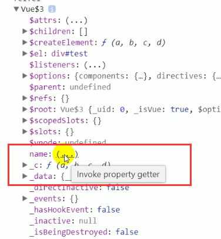

打印的vm结果中的name现在还看不见值，鼠标悬浮上去显示`Invoke property getter`，即为调用属性的getter，也就是说它的属性本身没有存值，而是通过getter去 _data里取值，点开后，显示了name的值，再往下看，出现了`get name`和`set name`方法，用来去 _data里面取数据`

```js
console.log(vm.name,vm);	//lulu	读操作
vm.name = 'minmin';		    //写操作
console.log(vm._data.name,vm.name);	//minmin
```

打印vm._data.name的值，可以直接打印出name的值(等同于vm.name)，现在这就是用到了数据代理，打印时，vm代理对data数据的读操作，赋值时vm代理了对数据的写操作

现在不引入vue，通过引入MVVM的js来实现数据代理

```html
		<div id="container"></div>
		<script src="../mvvm/compile.js"></script>
		<script src="../mvvm/mvvm.js"></script>
		<script src="../mvvm/observer.js"></script>
		<script src="../mvvm/watcher.js"></script>
		<script>
		var vm = new MVVM({
			el:'#container',
			data:{
				name:'lulu'
			}
		})
		console.log(vm._data.name,vm);
		vm.name = 'minmin';
		console.log(vm.name);
```

将js引入，把Vue改成MVVM（现在不用Vue来实现，而是只用MVVM思想来实现，也可以接着用Vue或者其它名称，但对应的要去找引入的js中相应的函数源码修改名称），打印结果如下

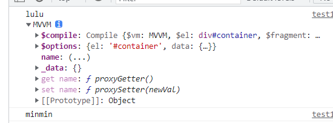

也是有`get name`与`set name`方法，也有 _data，和之前一样，可以看出这个库也可以实现数据代理的效果，结果是没有什么问题的，现在开始通过debug分析结果

进入构造MVVM对象的函数

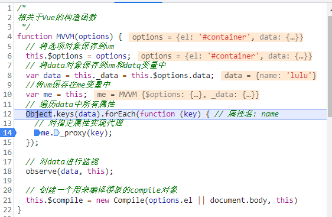

进入 _proxy函数，查看如何进行数据代理

**数据代理核心源码：**

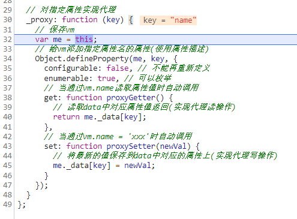

给vm对象添加属性：通过`defineProperty`实现，给vm实例对象添加属性（通过数据描述符的方式添加）

configurable：意为定义完后不能再修改（增加安全性，防止被恶意修改）

enumerable：可枚举（可遍历）

最重要的是get和set方法，我们通过vm.name去读这个结果，就调用get，修改vm.name，就调用set方法，数据最终保存在 _data里面。数据代理就此实现。

**注意：**`console.log(vm._data.name)`不会触发get方法（不需要代理），`console.log(vm.name)`会触发

## 模板解析

**基本流程**

- 将el的所有子节点取出，添加到一个新建的文档fragment对象中
- 对fragment中的所有层次子节点递归进行编译解析处理
  - 对大括号表达式文本节点进行解析
  - 对元素节点的指令属性进行解析
    - 时间指令解析
    - 一般指令解析

- 将解析后的fragment添加到el中显示

### 大括号表达式

从new一个MVVM开始进入到MVVM的构造函数，首先是存储数据再变量中，然后对指定属性实现代理，紧接着就是创建一个用来编译模板的compile对象来实现模板解析。

进入Compile构造函数中，先保存el元素然后取出它的所有子节点封装在一个fragment对象中，编译fragment中所有层次子节点

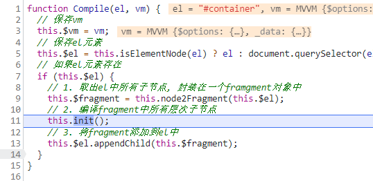

重点是init()初始化，里面调用了compileElement函数并传入了fragment对象（即为el）

**核心源码**

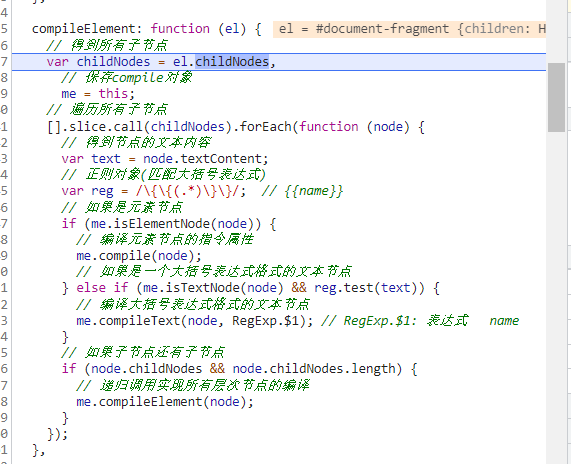

先取出el中最外层所有子节点，遍历所有子节点，得到节点的文本内容。定义一个正则表达式去匹配大括号。判断该节点是不是文本节点并利用正则检验是不是大括号表达式，如果是的话就进入compileText函数，如果不符合这个条件但是有子节点且子节点长度不为零，就传入此时的node继续判断子节点符合不符合（递归）

compileText函数传入的参数中的`RegExp.$1`，为正则表达式中匹配到的小括号中的内容（大括号中的表达式），把它取出来，比如{{name}}，`RegExp.$1`取到的就是name。在complieText函数中嵌套了complieUtil.text()函数

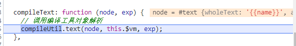

complieUtil.text中利用bind绑定text指令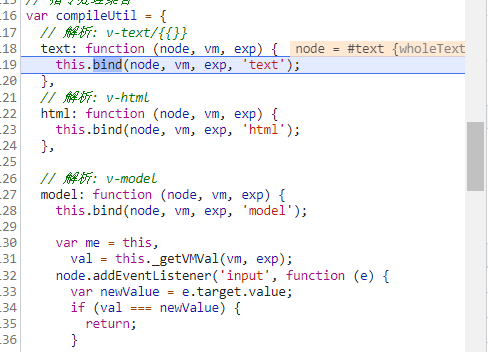

compileUtil中包含许多指令的对应方法，但都是向bind中传入自己的参数与指令名称。为什么要传入指令名称呢？

进入bind，他调用的`updater`如下

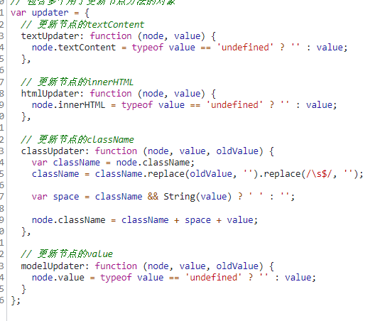

当传入的value类型为未定义，那么value设为空，否则设置为value

那么bind是怎么根据不同指令调用这些方法呢？

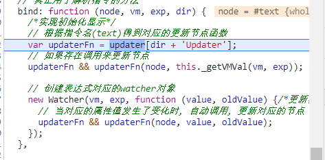

这些bind里调用的相应的函数中的名字组成都是各自的指令名字加Updater组成，（例如：testUpdater），bind中的传入dir为compileUtil中传入的指令名称（指令不同传入不同的指令名称），所以当传入text时，就会定义一个updaterFn来接收updater中的textUpdater函数。然后通过判断调用是否存在来决定调用updaterFn并传入参数，借此来操控节点属性。

回到bind函数中，得到对应的更新节点函数后，<font color=green>`updaterFn && updaterFn(node,this._getVMVal(vm,exp))`</font>，意思是如果存在调用来更新节点的话，就调用updaterFn并且传入相应的参数来更新节点，如果不存在的话右边的也不执行。这是一种简洁的写法，左边存在右边就执行，左边不存在右边就不执行。这就是上面说的通过判断决定调用。

`this._getVMVal(vm,exp)`函数取到vm的data中对应的值并返回，通过updaterFn将节点的textcontent值改为返回的val值（也就是vm的data中对应的值）

**注：**写成这样是为了严谨性（比如去查找a.b.c这样的属性值，如果直接vm[exp]就不对了，取不出来数据了，vm中没有a.b.c这个属性名，必须先根据a取出个值,再从这个值里再取b，得到之后再在这个值里选c，所以需要一个遍历的过程，一个从一个里面取）

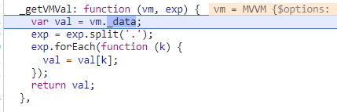

到此为止，大括号解析式解析完成

#### 总体流程总结

- 根据正则对象得到匹配出的表达式字符串：子匹配/`RegExp.$1`
- 从data中取出表达式对应的属性值
- 将属性值设置为文本节点的`textContent`

### 事件指令解析

**`v-on`指令**

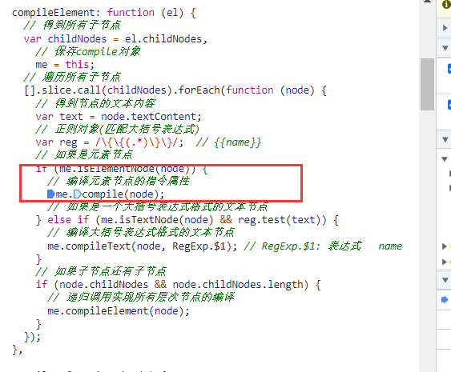

如果是大括号表达式的文本节点就进入大括号表达式的解析函数，如果是编译元素节点的指令属性，就进入compile中，编译指令。

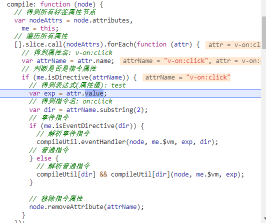

node.attributes获得所有节点的集合，并且遍历得到属性名`v-on:click`赋值给attrName，通过判断是否为指令（通过判断名字前面有没有`v-`），如果是的话就取出attr.value，赋予给exp（为绑定的函数名test）。通过`attrName.substring(2)`，获取到指令名`on:click`赋予给dir，

通过`isEventDirective(dir)`来判断是否dir以on开头，然后解析事件指令，进入到`compileUtil`中的`eventHandler`函数中进行事件处理，传入参数为当前节点，vm对象，以及绑定的函数名exp，和指令名dir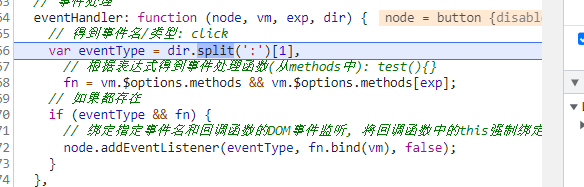

获取dir中的冒号后的事件名/类型：click，赋值给eventType，如果vm中存在方法就去找到vm中方法中名为exp（即为绑定的函数名）的函数test()，并赋给fn。如果eventType与fn都存在（即为存在事件类型（click）且有绑定的函数方法（show）），则绑定事件监听，将click绑定到fn事件上，并改变fn的this指向指为vm。

回到compile函数，`node.removeAttribute(attrName)`移除指令属性(移除`v-on:click`)

#### 总体流程总结

- 从指令名中取出事件名
- 根据指令的值（表达式）从methods中得到对应的事件处理函数对象
- 给当前元素节点绑定指定事件名和回调函数的dom事件监听
- 指令解析完后，移除此指令属性

### 一般指令解析

`v-text`,`v-html`,`v-class`

```html
<p v-text="msg"></p>
<p v-html="msg"></p>
```

#### v-text

循环解析标签属性节点

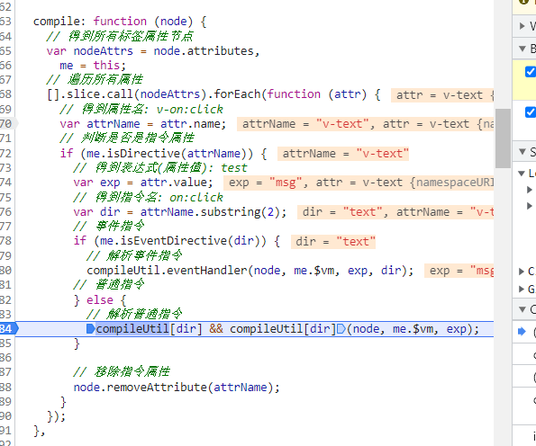

以text为例，先得到attrName为`v-text`，得到text的值为vm中的msg，获取指令名dir为text，如果是普通指令，如果`compileUtil[dir]`这个函数存在的话，就进入到`compileUtil[dir]`中，在这里是指compileUtil中的text函数，并传入当前节点，vm，exp（v-test绑定的值msg）


进入到bind方法，和之前一样，通过传入的指令名称，来组成即将调用的函数名，和大括号表达式的过程同理


当传入text时，就会定义一个updaterFn来接收updater中的textUpdater函数。然后通过判断调用是否存在来决定调用updaterFn并传入参数，借此来操控节点属性。

回到bind函数中，得到对应的更新节点函数后，<font color=green>`updaterFn && updaterFn(node,this._getVMVal(vm,exp))`</font>，意思是如果存在调用来更新节点的话，就调用updaterFn并且传入相应的参数来更新节点，如果不存在的话右边的也不执行。这是一种简洁的写法，左边存在右边就执行，左边不存在右边就不执行。这就是上面说的通过判断决定调用。

`this._getVMVal(vm,exp)`函数取到vm的data中对应的（msg）的值并返回，并传入updater的textUpdater函数中


进入到updaterFn（即为`updater中的textUpdater`），如果存在value(vm中对应值)就把刚刚取到的value插入到节点的文本内容中，否则为插入为空

`v-text`与大括号表达式其实原理是一样的，都是调用了text指令对应的函数，区别是一个是通过正则获取节点的文本内容中大括号中的文本，也就是获取exp（vm中对应内容），一个是解析节点，获取节点的value来获取vm中的对应内容exp，并且因为指令格式都为`v-xxx`，所以可以通过节点的name调用substring（2）方法来获取v-后面的指令名，来调用不同指令方法，最后移除指令属性。

#### v-html

`v-html`也是同理，也是这个过程，区别是通过bind函数调用了updater中的`htmlUpdater`，然后在该节点插入html代码，同样通过`this._getVMVal(vm,exp)`获取到vm中对应属性的value，然后通过通过`node.innerHTML`=value插入节点中。

##### 总结

- 得到指令名和指令值（表达式）  text/html   msg
- 从data中根据表达式得到对应的值
- 根据指令名确定需要操作元素节点的什么属性
  - v-text——textContent属性
  - v-html——innerHTML属性

- 将得到的表达式的值设置到对应的属性上
- 移除元素的指令属性

## 数据绑定

一旦更新了data中的某个属性数据，所有界面上直接使用或间接使用了此属性的节点都会更新

**基本原理：**给data中的属性（xxx），提供get和set（重点是set），监视这个值的变化。当输入`this.xxx = xxx（vm.xxx=xxx）`时，改变了vm的xxx的值，触发了vm 的set，vm的set会改变data里xxx的值，就会触发data的set，之后就会更新界面。

**简而言之就是**给data中的所有属性提供set方法，监视data中属性的变化，若有变化就更新界面

vm里的set和data的set作用是不太一样的，vm的set用来数据代理，data里的set用来实现数据绑定。

### 数据劫持

数据劫持是vue中用来实现数据绑定的一种技术

**基本思想**：通过defineProperty()来监视data中所有属性（任意层次）数据的变化，一旦变化就去更新界面

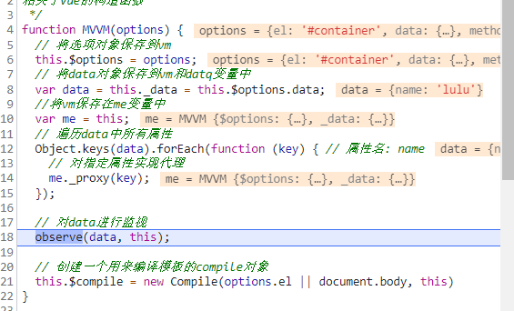

核心实现：通过observe对data进行监视

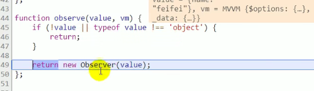

new一个观察者，监视value值。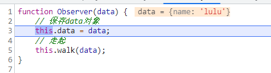

保存当前data， 进入到walk()，遍历data中所有属性后，每个属性进行处 理，进入convert函数

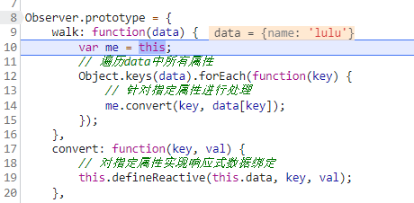

再从convert跳入到defineReactive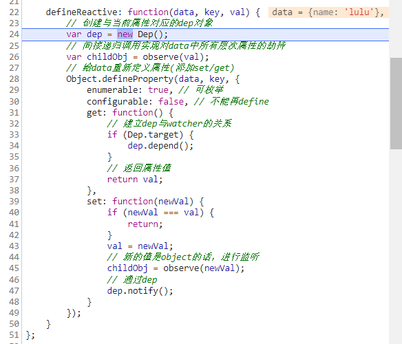

更新界面利用的是bind里的监听器Watcher()，监听exp的变化，当exp有变化的时候，调用updater。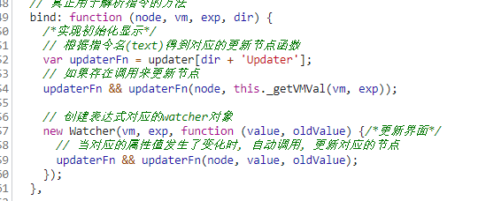

 进入watcher看里面的工作

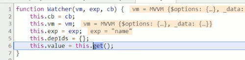

cb为callback，意为回调函数，保存一下vm和表达式，触发get方法取取值给value，此时这个get就涉及了Dep了。

### Dep与Watcher

**Dep是什么？**

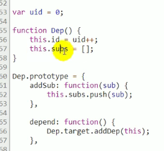

它自身有一个id，每次创建一个id加1，说明这个id是这个Dep的标识属性（id从零开始）

谁用到了这个数据，那么当这个数据变化时就通知谁。所谓谁用到了这个数据，其实就是谁获取了这个数据，而可观测的数据被获取时会触发`getter`属性，那么我们就可以在`getter`中收集这个依赖。同样，当这个数据变化时会触发`setter`属性，那么我们就可以在`setter`中通知依赖更新。

总结一句话就是：**在getter中收集依赖，在setter中通知依赖更新**。

我们给每个数据都建一个依赖数组，谁依赖了这个数据我们就把谁放入这个依赖数组中。单单用一个数组来存放依赖的话，功能好像有点欠缺并且代码过于耦合。我们应该将依赖数组的功能扩展一下，更好的做法是我们应该为每一个数据都建立一个依赖管理器，把这个数据所有的依赖都管理起来。OK，到这里，我们的依赖管理器`Dep`类应运而生

sub是`subscriber`的意思，意为订阅者,（也可以理解为依赖）那Dep里的subs就意为多个订阅者的数组，也就是里面每一个都放着`watcher`监视器

我们在`getter`中调用了`dep.depend()`方法收集依赖，在`setter`中调用`dep.notify()`方法通知所有依赖更新。

**Dep实例什么时候创建？创建个数？**

- 初始化的给data的属性进行数据劫持时创建的
- 个数与data中的属性一一对应

所有层次的属性都会进行劫持，要想劫持就要调用defineReactive方法，调用这个方法就会new一个Dep，**例如：**

```json
data:{
	name:'feifei',	//id:0
	wife:{			//id:1
		name:'lulu', //id:2
		age:28		//id:3
	}
}
```

如上数据，就会new 四个Dep实例

**Dep的结构？**

```js
function Dep() {
    // 标识属性
    this.id = uid++;
    // 相关的所有watcher的数组
    this.subs = [];
}
```

- id：标识（数值）
- subs（数组）：n个相关的watcher对象的容器

**Watcher的实例何时创建？创建个数？**

- 在初始化的解析大括号表达式/一般指令时创建
- 个数与模板中表达式（不包含事件指令）一一对应

**Watcher的结构？**

```js
function Watcher(vm, exp, cb) {
  this.cb = cb;  // callback
  this.vm = vm;
  this.exp = exp;
  this.depIds = {};  // {0: d0, 1: d1, 2: d2}
  this.value = this.get();
}
```

`this.cb = cb;`	:	用于更新界面的回调
`this.vm = vm;`	:	vm
`this.exp = exp;`	:	对应的表达式
`this.depIds = {};`	:	n个相关的dep的容器对象
`this.value = this.get();`	:	当前表达式对应的value

谁用到了数据，谁就是依赖，我们就为谁创建一个`Watcher`实例。在之后数据变化时，我们不直接去通知依赖更新，而是通知依赖对应的`Watch`实例，由`Watcher`实例去通知真正的视图。

在创建`Watcher`实例的过程中会自动的把自己添加到这个数据对应的依赖管理器中，以后这个`Watcher`实例就代表这个依赖，当数据变化时，我们就通知`Watcher`实例，由`Watcher`实例再去通知真正的依赖。

`Watcher`先把自己设置到全局唯一的指定位置（`window.target`），然后读取数据。因为读取了数据，所以会触发这个数据的`getter`。接着，在`getter`中就会从全局唯一的那个位置读取当前正在读取数据的`Watcher`，并把这个`watcher`收集到`Dep`中去。收集好之后，当数据发生变化时，会向`Dep`中的每个`Watcher`发送通知。通过这样的方式，`Watcher`可以主动去订阅任意一个数据的变化。

**整体大致过程：**

`vm.name = 'abc'`

 `—>data中的name属性值变化`

`—>name的set()调用`

`—>通知对应dep`

`—>通知所有相关watcher`

`—>cb()`//回调函数，为了去更新界面，调用了updater

`—>updater`

1. `Data`通过`observer`转换成了`getter/setter`的形式来追踪变化。
2. 当外界通过`Watcher`读取数据时，会触发`getter`从而将`Watcher`添加到依赖中。
3. 当数据发生了变化时，会触发`setter`，从而向`Dep`中的依赖（即Watcher）发送通知。
4. `Watcher`接收到通知后，会向外界发送通知，变化通知到外界后可能会触发视图更新，也有可能触发用户的某个回调函数等。


**Dep与Watcher之间的关系是什么？如何建立的？**

 **多对多关系**（n对n）

`一个name属性`—>`一个Dep`—>`n个Watcher（n=1,2.....n）`

==什么时候n大于1?==

模板中有多个表达式用了此属性（`{{name}}、v-text="name"`）

`表达式`—>`Watcher`—>`n个Dep（）`

==什么时候n大于1?==

在多层表达式中

例如`{{a.b}}`，它为一个表达式所以对应一个Watcher，但是包含了两个属性（a，b）就对应了两个Dep

**如何建立的？**

Dep与Watcher间，Dep先建立。（先`observe(data,this),再this.$compile`）。`observe(data，this)`对data中所有层次的属性通过数据劫持实现数据绑定，创建Dep。

关系实在data中属性的`get()`中建立 

对应关系举例如下：

```html
<div id="test">
    <p>{{name}}</p>		<!--watcher1--d0-->
    <p v-text="name"></p>	<!--watcher2--d0-->
    <p v-text = "wife.name"></p>	<!--watcher3--{d1,d2}-->
    <!--d0--[watcher1.watcher2]-->
    <button v-on:click="update"></button>
</div>
```

**图解**

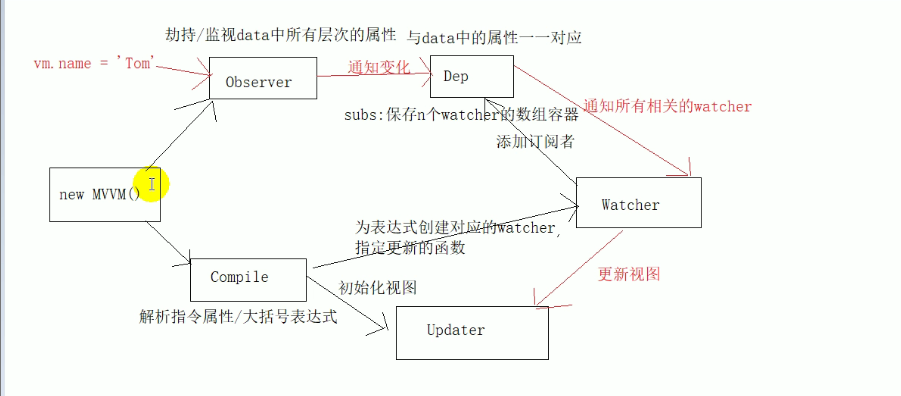

new MVVM()过程中创建两个实例，一个是observer一个是Compile。observer用来实现对数据的劫持或监视，这里面依赖于Dep，要创建对应的Dep。在初始化的时候是没有通知变化的那根线的。Complie有两个事情，一个是初始化视图（解析指令属性/大括号表达式），一个是创建对应的Watcher，创建Watcher是为了后面来更新视图，创建watcher内部需要去建立Dep与Watcher之间的关系，将Watcher添加到对应的Dep里面。
**一个Watcher一定会对应一个Dep吗？**

不一定。要看属性，比如a.b.c，一个属性一个Dep，就是三个Dep。


更新vm的数据（一个属性）实则导致data的属性变化了，data属性有set监视，里面就会通知的对应的Dep(只会通知1个Dep，因为只有一个属性，但会可能关联N个Watcher)

### 双向绑定v-model

先进行解析（和其它指令相同），调用compileUtil里的model函数，调用bind，先进行初始化显示，把node里的value显示出来，最后会调用updater中的modelUpdater方法。

获取到当前表达式的值，把这个值设置到节点的value属性上面（`node.value`），实现了界面的初始化显示，并为当前表达式创建了一个对应的Watcher。

再回到model函数，保存当前的compile，取表达式所对应的值，添加事件监听input监听，判断新的值与之前的值是否相等，如果不相等，将最新的值保存到data里（`me._setVMVal`），这个过程会触发data的set方法，就会更新界面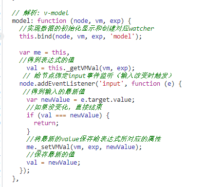

**总体大概流程：**

- 双向数据绑定是建立在单向数据绑定`（model==>View）`的基础之上的
- 双向数据绑定的实现流程：
  - 在解析`v-model`指令时，给当前元素添加`input`监听
  - 当`input`的`value`发生改变时，将最新的值赋值给当前表达式所对应的`data`属性

## 虚拟DOM

**在Vue中对虚拟DOM是如何实现的？**

**什么是虚拟DOM？**

所谓虚拟`DOM`，就是用一个`JS`对象来描述一个`DOM`节点，例如以下

```javascript
<div class="a" id="b">我是内容</div>

{
  tag:'div',        // 元素标签
  attrs:{           // 属性
    id:'b'
  },
  text:'我是内容',  // 文本内容
  children:[]       // 子元素
}
```

我们把组成一个`DOM`节点的必要东西通过一个`JS`对象表示出来，那么这个`JS`对象就可以用来描述这个`DOM`节点，我们把这个`JS`对象就称为是这个真实`DOM`节点的虚拟`DOM`节点。

**为什么要有虚拟DOM？**

Vue是数据驱动视图的，数据发生变化视图就要随之更新，在更新视图的时候难免要操作`DOM`，而操作真实`DOM`又是非常耗费性能的，因为`DOM`设计的十分复杂，一个真正的`DOM`元素是非常庞大的，如下


一个空的`div`标签，就能打印出这么多东西，而不用说更复杂的`DOM`节点了，所以直接操作真实`DOM`是非常消耗性能的。

那如何在更新视图的时候尽可能少的操作`DOM`呢？最直观的思路就是我们不要盲目的去更新视图，而是通过对比数据变化前后的状态，计算出视图中哪些地方需要更新，只更新需要更新的地方，而不需要更新的地方则不需关心，这样我们就可以尽可能少的操作`DOM`了。

我们可以用`JS`模拟出一个`DOM`节点，称之为虚拟`DOM`节点。当数据发生变化时，我们对比变化前后的虚拟`DOM`节点，通过`DOM-Diff`算法计算出需要更新的地方，然后去更新需要更新的视图。

### Vue中的虚拟DOM

#### VNode类

在Vue中存在了一个VNode类，通过这个类，我们就可以实例化出不同类型的虚拟DOM节点

```js
function VNode(
    tag, data, children, 
    text, elm, context, 
    componentOptions

) {    

    this.tag = tag; // 标签名

    this.data = data;    

    this.children = children; // 子元素

    this.text = text; // 文本内容

    this.elm = elm; // Dom 节点


    this.context = context;    

    this.componentOptions = componentOptions;    

    this.componentInstance = undefined;    

    this.parent = undefined;    

    this.isStatic = false; // 是否静态节点

    this.isComment = false; // 是否是注释节点

    this.isCloned = false; // 是否克隆节点

};
```

代码中，VNode类中包含了描述一个真实DOM节点所需要的一系列属性，如节点标签名，节点文本，节点包含的子节点等，通过属性之间不同搭配，就可以描述出各种类型的DOM节点

##### VNode的类型

它可以描述出哪些类型的节点呢？

- 注释节点
- 文本节点
- 元素节点
- 组件节点
- 函数式组件节点
- 克隆节点

`VNode`类可以描述6种类型的节点，而实际上只有3种类型的节点能够被创建并插入到`DOM`中，它们分别是：元素节点、文本节点、注释节点。

**注释节点：**

```javascript
export const createEmptyVNode = (text: string = '') => {
  const node = new VNode()
  node.text = text
  node.isComment = true
  return node
}
```

描述一个注释节点只需两个属性，分别是：`text`和`isComment`。其中`text`属性表示具体的注释信息，`isComment`是一个标志，用来标识一个节点是否是注释节点

**文本节点：**

文本节点描述起来比注释节点更简单，只需要一个属性——text

```javascript
// 创建文本节点
export function createTextVNode (val: string | number) {
  return new VNode(undefined, undefined, undefined, String(val))
}
```

**克隆节点：**

克隆节点就是把一个已经存在的节点复制一份出来，它主要是为了做模板编译优化时使用

```javascript
// 创建克隆节点
export function cloneVNode (vnode: VNode): VNode {
  const cloned = new VNode(
    vnode.tag,
    vnode.data,
    vnode.children,
    vnode.text,
    vnode.elm,
    vnode.context,
    vnode.componentOptions,
    vnode.asyncFactory
  )
  cloned.ns = vnode.ns
  cloned.isStatic = vnode.isStatic
  cloned.key = vnode.key
  cloned.isComment = vnode.isComment
  cloned.fnContext = vnode.fnContext
  cloned.fnOptions = vnode.fnOptions
  cloned.fnScopeId = vnode.fnScopeId
  cloned.asyncMeta = vnode.asyncMeta
  cloned.isCloned = true
  return cloned
}
```

从上面代码中可以看到，克隆节点就是把已有节点的属性全部复制到新节点中，而现有节点和新克隆得到的节点之间唯一的不同就是克隆得到的节点`isCloned`为`true`

**元素节点：**

相比之下，元素节点更贴近于我们通常看到的真实`DOM`节点，它有描述节点标签名词的`tag`属性，描述节点属性如`class`、`attributes`等的`data`属性，有描述包含的子节点信息的`children`属性等。由于元素节点所包含的情况相比而言比较复杂，源码中没有像前三种节点一样直接写死

```javascript
// 真实DOM节点
<div id='a'><span>难凉热血</span></div>

// VNode节点
{
  tag:'div',
  data:{},
  children:[
    {
      tag:'span',
      text:'难凉热血'
    }
  ]
}
```

真实`DOM`节点中:`div`标签里面包含了一个`span`标签，而`span`标签里面有一段文本。反应到`VNode`节点上就如上所示:`tag`表示标签名，`data`表示标签的属性`id`等，`children`表示子节点数组

##### VNode的作用

**那么`VNode`在`Vue`的整个虚拟`DOM`过程起了什么作用呢？**

我们在视图渲染之前，把写好的`template`模板先编译成`VNode`并缓存下来，等到数据发生变化页面需要重新渲染的时候，我们把数据发生变化后生成的`VNode`与前一次缓存下来的`VNode`进行对比，找出差异（**diff算法**），然后有差异的`VNode`对应的真实`DOM`节点就是需要重新渲染的节点，最后根据有差异的`VNode`创建出真实的`DOM`节点再插入到视图中，最终完成一次视图更新。

**总结：**

首先是为什么要有虚拟`DOM`，其实说白了就是**以`JS`的计算性能来换取操作真实`DOM`所消耗的性能**。然后知道了在Vue中是通过`VNode`类来实例化出不同类型的虚拟`DOM`节点，不同类型节点生成的属性不同，但本质还是一样的，都是`VNode`的实例，知识在实例化时传入的属性参数不同。有了数据变化前后的`VNode`，我们就能进行`DOM-Diff`来找出差异，最终做到只更新有差异的视图，从而达到尽可能少的操作真实`DOM`的目的。

##### Vue2.0 render

**==关于Vue2.0 render: h => h(App)的解释==**

render: h => h(App)是ES6的写法，其实就是如下内容的简写：

```js
render: function (createElement) {
     return createElement(App);
}
```

官方文档中是这样的，`createElement `是 Vue.js 里面的 函数，这个函数的作用就是生成一个 `VNode`节点，`render` 函数得到这个 `VNode` 节点之后，返回给 Vue.js 的 `mount` 函数，渲染成真实` DOM` 节点，并挂载到根节点上。

```js
render: function (createElement) {
    return createElement(
      'h' + this.level,   // tag name 标签名称
      this.$slots.default // 子组件中的阵列
    )
  }
```

然后ES6写法,

```js
render: createElement => createElement(App)
```

然后用h代替createElement，使用箭头函数来写：

```js
render: h => h(App)
```

**那么h的含义是什么？**

尤雨溪在一个回复中提到：

> 它来自单词 hyperscript，这个单词通常用在 virtual-dom 的实现中。Hyperscript 本身是指
> 生成HTML 结构的 script 脚本，因为 HTML 是 hyper-text markup language 的缩写（超文本标记语言）

也就是说，createElement 函数是用来生成 HTML DOM 元素的，而上文中的 Hyperscript也是用来创建HTML结构的脚本，这样作者才把 createElement 简写成 h。

而 createElement(也就是h)是vuejs里的一个函数。这个函数的作用就是生成一个 VNode节点，render 函数得到这个 VNode 节点之后，返回给 Vue.js 的 mount 函数，渲染成真实 DOM 节点，并挂载到根节点上。

其实在vue 1.0 中，这样的写法也就是如下的含义：

```js
new Vue({
  el: '#app',
  template:'</App>'
  componets: {App}
})
```

然后页面中使用

```html
<div id='app'>
  <app></app>
</div>
```

### Vue中的DOM-Diff

在探究`VNode`作用时，说过数据发生变化后生成的`VNode`与前一次缓存下来的`VNode`进行对比，找出差异，而这个对比`VNode`并找出差异的过程就是所谓的`DOM-Diff`过程。`DOM-Diff`算法是虚拟DOM的核心所在

#### patch

在Vue中，把`DOM-Diff`过程叫做`patch`过程,patch意为补丁，即指对旧的`VNode`修补，打补丁从而得到新的`VNode`。说白了就是比对新旧两份`VNode`的过程。要把握这样一个思想：

> 所谓的旧的VNode(即oldVNode)，就是数据变化之前视图所对应的虚拟DOM节点，而新的VNode是数据变化之后将要渲染的新的视图所对应的虚拟DOM节点，所以我们要以生成的新的VNode为基准，对比旧的oldVNode，如果新的VNode上有的节点而旧的oldVNode没有，那么就在旧的oldVNode上加上；如果新的VNode上没有的节点而旧的oldVNode有，那么就在oldVNode上去掉；如果某些节点在新的VNode上和旧的oldVNode上都有，那么就以新的VNode为准，更新旧的oldVNode,从而让新旧VNode相同。

通俗点讲，假设你电脑上现在有一份旧的电子版文档，此时老板又给了你一份新的纸质板文档，并告诉你这两份文档内容大部分都是一样的，让你以新的纸质版文档为准，把纸质版文档做一份新的电子版文档发给老板。对于这个任务此时，你应该有两种解决方案：一种方案是不管它旧的文档内容是什么样的，统统删掉，然后对着新的纸质版文档一个字一个字的敲进去，这种方案就是不用费脑，就是受点累也能解决问题。而另外一种方案是以新的纸质版文档为基准，对比看旧的电子版文档跟新的纸质版文档有什么差异，如果某些部分在新的文档里有而旧的文档里没有，那就在旧的文档里面把这些部分加上；如果某些部分在新的文档里没有而旧的文档里有，那就在旧的文档里把这些部分删掉；如果某些部分在新旧文档里都有，那就对比看有没有需要更新的，最后在旧的文档里更新一下，最终达到把旧的文档变成跟手里纸质版文档一样，完美解决。

对比这两种方案，当然你会选择第二种方案，可以少挨累又省时间，类比下来，第二种方案里的旧的电子版文档对应的就是已经渲染在视图上的`oldVNode`，新的纸质版文档对应的是将要渲染在视图上的新的`VNode`。总之一句话：**以新的VNode为基准，改造旧的oldVNode对之进行修补，使之成为跟新的VNode一样，这就是patch过程要干的事**。

看起来patch做了很多事，实则不然，它无非就干三件事

**那么patch都干了什么事？**

- 创建节点：新的`VNode`中有而旧的`oldVNode`中没有，就在旧的`oldVNode`中创建。

- 删除节点：新的`VNode`中没有而旧的`oldVNode`中有，就从旧的`oldVNode`中删除。
- 更新节点：新的`VNode`和旧的`oldVNode`中都有，就以新的`VNode`为准，更新旧的`oldVNode`。

现在来逐个分析，看Vue对于以上三件事是怎么做的

##### 创建节点

在上面介绍`VNode`时，曾提及过，只有元素节点、文本节点以及注释节点能够被创建并插入到`DOM`中。所以`Vue`在创建节点的时候会判断在新的`VNode`中有而旧的`oldVNode`中没有的这个节点是属于哪种类型的节点，从而调用不同的方法创建并插入到`DOM`中。

由于这三种类型的节点其特点非常明显，在源码中是这样判断的

```javascript
// 源码位置: /src/core/vdom/patch.js
function createElm (vnode, parentElm, refElm) {
    const data = vnode.data
    const children = vnode.children
    const tag = vnode.tag
    //如果包含tag标签
    if (isDef(tag)) {
      	vnode.elm = nodeOps.createElement(tag, vnode)   // 创建元素节点
        createChildren(vnode, children, insertedVnodeQueue) // 创建元素节点的子节点
        insert(parentElm, vnode.elm, refElm)       // 插入到DOM中
        //如果isComement属性位true
    } else if (isTrue(vnode.isComment)) {
      vnode.elm = nodeOps.createComment(vnode.text)  // 创建注释节点
      insert(parentElm, vnode.elm, refElm)           // 插入到DOM中
        //否则
    } else {
      vnode.elm = nodeOps.createTextNode(vnode.text)  // 创建文本节点
      insert(parentElm, vnode.elm, refElm)           // 插入到DOM中
    }
  }
```

